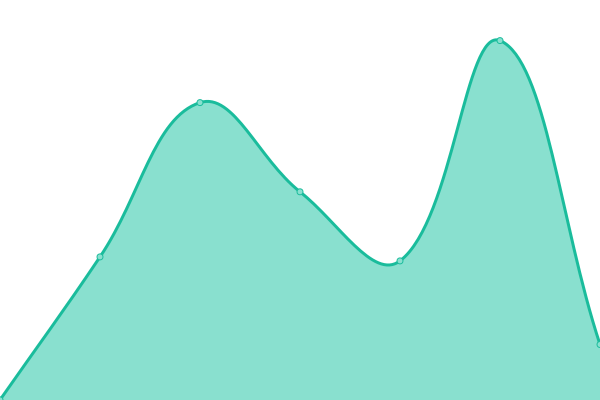

# [📈 Live Status](https://zootsewt.github.io/aimonitor): <!--live status--> **🟩 All systems operational**

This repository contains the open-source uptime monitor and status page for [zootsewt](https://zootsewt.github.io/aimonitor), powered by [Upptime](https://github.com/upptime/upptime).

With [Upptime](https://upptime.js.org), you can get your own unlimited and free uptime monitor and status page, powered entirely by a GitHub repository. We use [Issues](https://github.com/zootsewt/aimonitor/issues) as incident reports, [Actions](https://github.com/zootsewt/aimonitor/actions) as uptime monitors, and [Pages](https://zootsewt.github.io/aimonitor) for the status page.

<!--start: status pages-->
<!-- This summary is generated by Upptime (https://github.com/upptime/upptime) -->
<!-- Do not edit this manually, your changes will be overwritten -->
<!-- prettier-ignore -->
| URL | Status | History | Response Time | Uptime |
| --- | ------ | ------- | ------------- | ------ |
|  [AI For Students](https://armyignited.army.mil/student) | 🟩 Up | [ai-for-students.yml](https://github.com/zootsewt/aistatus/commits/HEAD/history/ai-for-students.yml) | 

 1376ms
     
 | 

<a href="https://zootsewt.github.io/aistatus/history/ai-for-students">100.00%</a>
    

|  [AI For Admin](https://armyignited.army.mil/admin) | 🟩 Up | [ai-for-admin.yml](https://github.com/zootsewt/aistatus/commits/HEAD/history/ai-for-admin.yml) | 

 3074ms
     
 | 

<a href="https://zootsewt.github.io/aistatus/history/ai-for-admin">94.86%</a>
    

|  [Academic Institution Portal](https://aiportal.army.mil/aiportal/Account/ConsentToMonitor) | 🟩 Up | [academic-institution-portal.yml](https://github.com/zootsewt/aistatus/commits/HEAD/history/academic-institution-portal.yml) | 

 1785ms
     
 | 

<a href="https://zootsewt.github.io/aistatus/history/academic-institution-portal">100.00%</a>
    

<!--end: status pages-->

[**Visit our status website →**](https://zootsewt.github.io/aimonitor)

## 📄 License

- Powered by: [Upptime](https://github.com/upptime/upptime)
- Code: [MIT](./LICENSE) © [zootsewt](https://zootsewt.github.io/aimonitor)
- Data in the `./history` directory: [Open Database License](https://opendatacommons.org/licenses/odbl/1-0/)
